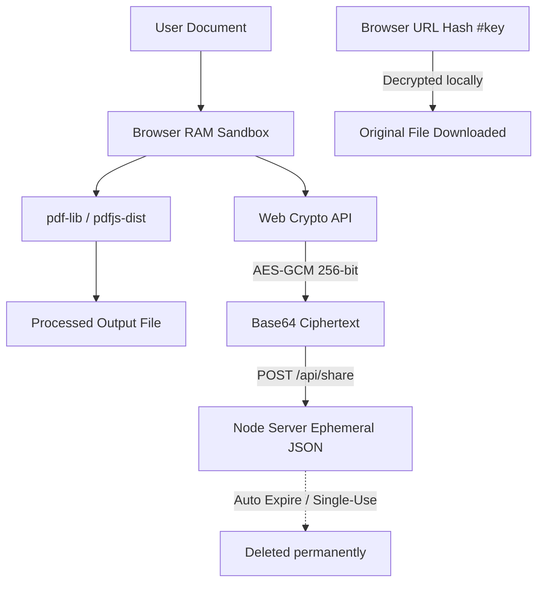

# MORPEE 📄🔒

### The Privacy-First, Local-Offline Document Engine & Govt Exam Resizer

MORPEE is a premium, state-of-the-art web workspace designed for applicants, candidates, and operators (specifically tailored for Indian exams like UPSC, SSC, NTA, and college portals, as well as global standards). It provides a full catalog of document utilities that run **100% locally in browser sandboxed memory (RAM)**, alongside zero-knowledge secure document sharing.

---

## 🌟 Key Features

### 1. Preset-Based Photograph & Signature Resizer
Optimized for strict Indian government portals (UPSC CSE, SSC CGL/CHSL, NTA, NEET, JEE) to guarantee compliant uploads:
- **Exact Presets**: Auto-configures dimensions, ratios, and file sizes for photos and signatures.
  - *SSC Photograph*: 350x450 px (20-50 KB, 7:9 ratio)
  - *SSC Signature*: 280x120 px (10-20 KB, 7:3 ratio)
  - *UPSC Photograph*: 550x550 px (20-300 KB, 1:1 ratio)
  - *UPSC Signature*: 350x350 px (20-300 KB, 1:1 ratio)
- **Quality Clamping**: Client-side target size fitting (e.g. compressing an image to exactly 45 KB without violating resolution constraints).
- **Interactive Cropper**: Visual canvas-based cropping or edge padding.

### 2. Multi-Page Document Scanner
- **Mobile Camera / Scanner Integration**: Capture paper documents, mark corners, and auto-warp page perspectives.
- **Magic Eraser**: Clean shadows and enhance text contrast locally.
- **Offline OCR**: Client-side Optical Character Recognition to extract text and make scans searchable.

### 3. Comprehensive PDF Workbench
- **Organize Pages**:
  - **Merge PDF**: Combine multiple PDFs into a single file.
  - **Split PDF**: Extract page ranges (e.g., `1-3, 5`) into a new PDF.
  - **Organize PDF**: Drag, reorder, rotate, or delete individual pages visually.
  - **Crop PDF**: Crop and trim margins client-side.
- **Edit & Sign**:
  - **Fill & Sign**: Add text overlays, electronic signatures, and date stamps.
  - **Watermark**: Overlay custom text with control over opacity, color, size, and angle.
  - **Page Numbers**: Add header/footer page numbers in multiple positions.
  - **Metadata Editor**: Modify PDF headers (Title, Author, Subject, Keywords).
- **Convert File Formats**:
  - Convert Word, Excel, PowerPoint, HTML, TXT, RTF, and ODT to PDF.
  - Convert PDF to Images, Text, Word, Excel, PowerPoint, and HTML.
- **Optimize & Secure**:
  - **Compress PDF**: Compress documents while maintaining visual readability.
  - **Redact PDF**: Blackout and sanitize sensitive PII (like Aadhaar/PAN) before upload.
  - **Add/Remove Passwords**: Standard PDF password encryption/decryption.

### 4. Zero-Knowledge Cryptographic Sharing
- **100% Client-Side Encryption**: Encrypts files in the browser using **AES-GCM (256-bit)** before they are sent to the network.
- **No-Key-to-Server Policy**: The encryption/decryption key is appended to the URL hash fragment (`#key=...`). Since browsers do not transmit hash fragments to HTTP servers, the key is never exposed to the internet.
- **Password Protection**: Optionally derives AES keys client-side using **PBKDF2** (100,000 iterations).
- **Ephemeral Auto-Purge**: Supports auto-expiration (5 minutes, 1 hour, 1 day) and single-download limits. Payload files on the server (`data/shares/[id].json`) are permanently shredded upon expiration or download limit exhaustion.

### 5. Offline AI Document Assistant
- **Document Chat**: Ask questions directly to your PDF using browser-native parsers.
- **AI Summary**: Instantly summarize long legal or educational PDFs.
- **Translation**: Translate document summaries into Indian regional languages (Hindi, Bengali, Tamil, Telugu) or global languages (Spanish, French).
- **Test Generator**: Generate custom multiple-choice (MCQ) or True/False mock questions directly from study materials.

---

## 🛠️ Architecture & Tech Stack

MORPEE uses a local-first architecture to protect user privacy. No user document is ever uploaded to an external server.



- **Frontend**: Next.js (App Router), React, Tailwind CSS, TypeScript.
- **PDF Core Engines**: `pdf-lib` (writing/modifying PDFs), `pdfjs-dist` (parsing, rendering, and text-extracting).
- **Cryptography**: Web Crypto API (SubtleCrypto) for AES-GCM encryption/decryption and PBKDF2 key derivation.
- **Backend Services**: Node.js API handlers storing metadata-minimal encrypted payloads with cron-based automated disk cleanup.

---

## 🚀 Getting Started

### Prerequisites
- Node.js (v18.x or later)
- npm (v9.x or later)

### Installation

1. Clone the repository:
   ```bash
   git clone https://github.com/your-username/morpee.git
   cd morpee
   ```

2. Install dependencies:
   ```bash
   npm install
   ```

3. Set up environment variables (optional):
   Create a `.env.local` file in the root directory if you want to override defaults.

4. Run the local development server:
   ```bash
   npm run dev
   ```

5. Open [http://localhost:3000](http://localhost:3000) in your browser.

---

## 📂 Project Structure

```
├── data/                  # Ephemeral sharing payload disk storage
├── public/                # Static assets, Web workers, Service worker
├── src/
│   ├── app/               # Next.js page routes & layouts
│   │   ├── (auth)/        # Auth pages
│   │   ├── (workspace)/   # Core Workspace & hub components
│   │   ├── api/           # Ephemeral sharing API endpoints
│   │   └── share/         # Ephemeral share decrypting pages
│   ├── components/        # React components (ui controls, telemetry)
│   ├── utils/             # Local engines (crypto, image resizer, compressor)
│   └── styles/            # Tailwind CSS & global layout system
```

---

## 🔒 Security & Privacy Spec
- **Browser-Only Worksheets**: Operations on documents (resizing, merging, watermarking) occur entirely inside the browser's sandbox.
- **Zero Tracker Footprint**: The application does not deploy tracking pixels or cookies.
- **Secure Share Decryption Flow**:
  1. The browser generates a random 256-bit AES key.
  2. The file is encrypted using `AES-GCM`.
  3. The ciphertext is uploaded to the server and assigned a UUID.
  4. The browser displays a link with the key placed after the `#` character.
  5. The recipient's browser fetches the ciphertext from `/api/share/[id]`, extracts the key from the window location hash, decrypts the payload client-side, and initiates a local save.
